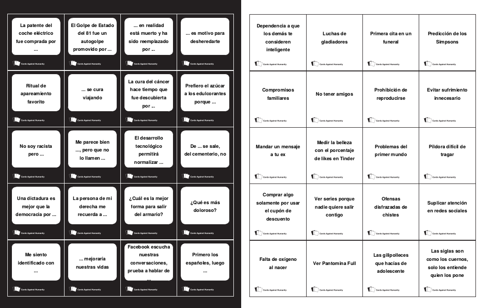

# Cards Against Humanity card generator

This program generates a pdfs with cards for the game [Cards Against Humanity](https://cardsagainsthumanity.com/) using files in plain text.


## Usage

We will use Python3 with the following dependencies:

```
PyPDF2
```

File(s) with sentences must be placed inside **Input/BlackCards** and **Input/WhiteCards** respectively (one sentence per line). 

Run the program and see the result in **Output/**

```
$ ./main.py
```

## Example
Given these files:

*Input/BlackCards/example.txt*
```
... es motivo para desheredarte
... en realidad está muerto y ha sido reemplazado por ...
El Golpe de Estado del 81 fue un autogolpe promovido por ...
La patente del coche eléctrico fue comprada por ... 
Prefiero el azúcar a los edulcorantes porque ...
La cura del cáncer hace tiempo que fue descubierta por ...
... se cura viajando
Ritual de apareamiento favorito
De ... se sale, del cementerio, no
El desarrollo tecnológico permitirá normalizar ...
Me parece bien ..., pero que no lo llamen ...
No soy racista pero ...
¿Qué es más doloroso?
¿Cuál es la mejor forma para salir del armario?
La persona de mi derecha me recuerda a ...
Una dictadura es mejor que la democracia por ...
Primero los españoles, luego ...
Facebook escucha nuestras conversaciones, prueba a hablar de ...
... mejoraría nuestras vidas
Me siento identificado con ...
```

*Output/WhiteCards/example.txt*
```
Predicción de los Simpsons
Primera cita en un funeral
Luchas de gladiadores
Dependencia a que los demás te consideren inteligente
Evitar sufrimiento innecesario
Prohibición de reproducirse
No tener amigos
Compromisos familiares
Píldora difícil de tragar
Problemas del primer mundo
Medir la belleza con el porcentaje de likes en Tinder
Mandar un mensaje a tu ex
Suplicar atención en redes sociales
Ofensas disfrazadas de chistes
Ver series porque nadie quiere salir contigo
Comprar algo solamente por usar el cupón de descuento
Las siglas son como los cuernos, solo los entiende quien los pone
Las gilipolleces que hacías de adolescente
Ver Pantomina Full
Falta de oxígeno al nacer
```

the output file would be a pdf with:




## License
Creative Commons BY-NC-SA 2.0 License